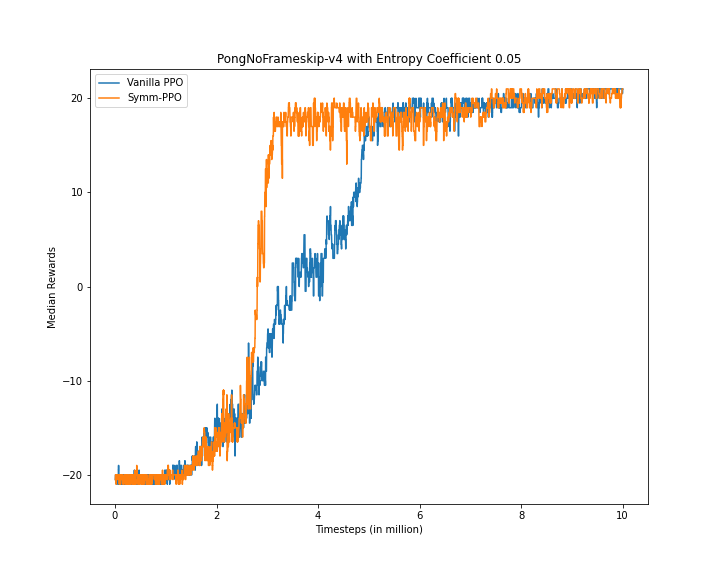
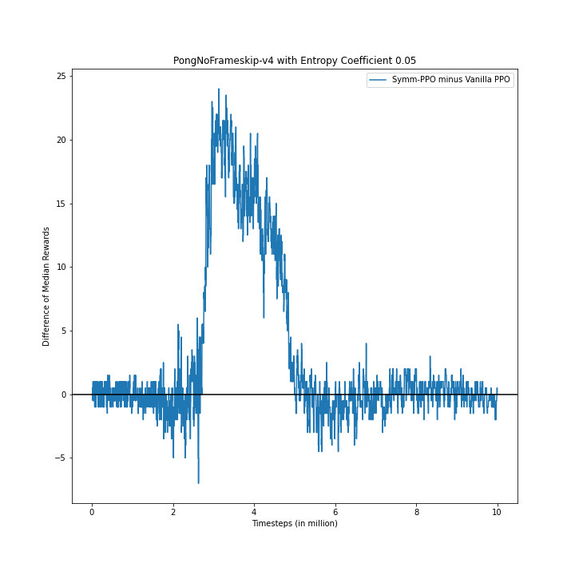
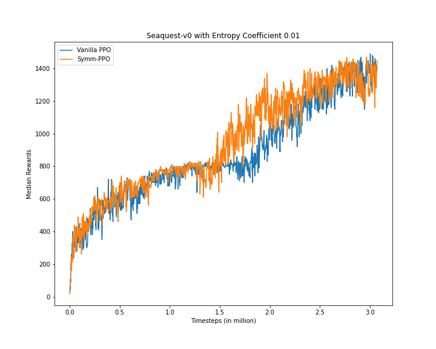
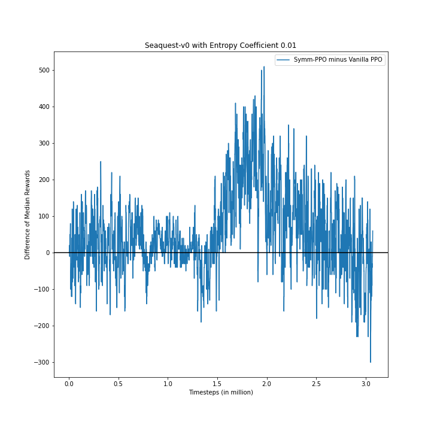

# Symm-PPO
Proximal Policy Optimization with Symmetric Entropy

## Motivation
Reinforcement Learning is very sensitive to hyperparameters. I was stuck with a problem in my final year project where the the agent wasn't making progress and was stuck in a sub-optimal policy when I was using PPO. This is when I increased the entropy coefficient value in the existing vanilla PPO framework. Choosing such coefficients is hard and daunting in general. Since PPO follows on the analogy of new policy not being too different from the old one, I tried to inculcate the same idea to the entropy but the entropy is symmetric.

## Algorithm


## Prerequisites
<li>Python 3</li>
<li>PyTorch (Tested on 1.12.1)</li>
<li>gym==0.17.3</li>
<li>pybullet==3.1.6</li>
<li>stable-baselines3==1.0</li>
<li>matplotlib</li>

## Installation
Please clone this repository to your local machine
```
git clone https://github.com/AnirudhMaiya/Symm-PPO
```
After cloning check into the src folder of the repository 
```python
!pip install -r requirements.txt

import urllib.request
urllib.request.urlretrieve('http://www.atarimania.com/roms/Roms.rar','Roms.rar')
!pip install unrar
!unrar x Roms.rar
!mkdir rars
!mv "HC ROMS" rars
!mv "ROMS" rars
!python -m atari_py.import_roms rars

#--algo ppo is actually Symm-PPO here!!!
!python main.py --env-name "PongNoFrameskip-v4" --algo ppo --use-gae --lr 2.5e-4 --clip-param 0.1 --value-loss-coef 0.5 --num-processes 8 --num-steps 128 --num-mini-batch 1 --log-interval 1 --use-linear-lr-decay --entropy-coef 0.05
```
The above code can also be executed through a jupyter notebook <a href = 'https://github.com/AnirudhMaiya/Symm-PPO/blob/main/Run_Symm-PPO.ipynb'>Run_Symm-PPO.ipynb</a>

## Results
### PongNoFrameskip-v4 



### Seaquest-v0



### Special thanks to <a href = 'https://github.com/ikostrikov/pytorch-a2c-ppo-acktr-gail'>pytorch-a2c-ppo-acktr-gail</a> repository.
